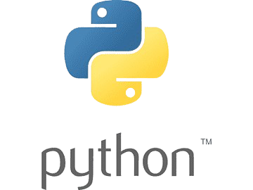
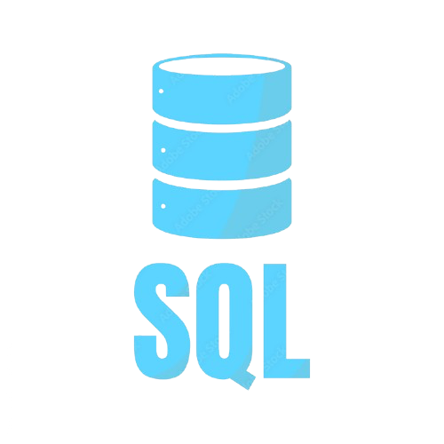
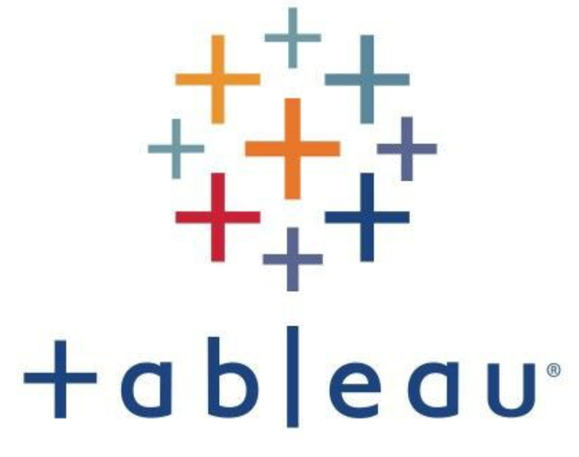

# 👋 Intro 김준희 데이터분석가 & 딥러닝 개발자

> 안녕하세요! 데이터를 통해 의미 있는 인사이트 발견하고 딥러닝으로 새로운 가능성을 열어가고 싶은 📊데이터 분석가와 🤖딥러닝 개발자를 희망하는 김준희입니다!
>
> 프로젝트를 통해 데이터 전처리, 분석, 시각화 전 과정을 수행하며 가독성과 재사용성을 고려한 코드 작성 능력과 데이터 처리 파이프라인 구현 경험을 쌓았고 딥러닝 모델 개발을 통해 데이터 기반 문제 해결 능력과 모델 최적화 기술 역량을 발전시켜 왔습니다.
> 
> 프로젝트에 대한 내용은  이곳을 통해 확인하실 수 있습니다!

# 💻 SKILL 스택 및 역량

-  **Python** 
  - Pandas와 NumPy를 활용하여 데이터 전처리 및 분석  
  - TensorFlow와 PyTorch를 이용한 딥러닝 모델 개발 및 하이퍼파라미터 최적화  
  - Matplotlib을 사용한 데이터 시각화
  - numpy를 사용하여 머신러닝 코드 구현
  - BeautifulSoup을 활용한 사이트 크롤링 코드 구현

-  **R**
  - ggplot2를 이용한 데이터 시각화와 패턴 분석
  - 머신러닝 및 통계 모델링을 통해 데이터 분석 및 예측 모델 설계  
  - dplyr을 활용한 대규모 데이터 처리 및 효율적인 데이터 전처리 

-  **SQL**
  - DML(데이터 조작어)과 DDL(데이터 정의어)을 활용한 데이터 처리 및 테이블 구조 관리  
  - 다양한 Join 및 서브쿼리를 이용한 복잡한 데이터 분석 및 병합 작업 수행
  - 성능 최적화를 위한 데이터베이스 튜닝

-  **Tableau**
  - 대시보드 설계 및 데이터 시각화를 통한 인사이트 제공  

 
