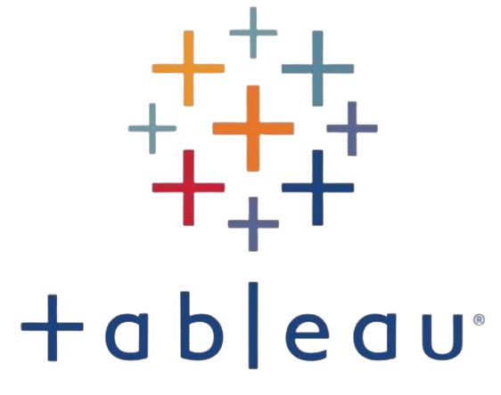

# 👋 Intro 김준희 데이터분석가 & 딥러닝 개발자

> 안녕하세요! 데이터를 통해 의미 있는 인사이트 발견하고 딥러닝으로 새로운 가능성을 열어가고 싶은 📊데이터 분석가와 🤖딥러닝 개발자를 희망하는 김준희입니다!
>
> 프로젝트를 통해 데이터 전처리, 분석, 시각화 전 과정을 수행하며 가독성과 재사용성을 고려한 코드 작성 능력과 데이터 처리 파이프라인 구현 경험을 쌓았고 딥러닝 모델 개발을 통해 데이터 기반 문제 해결 능력과 모델 최적화 기술 역량을 발전시켜 왔습니다.
> 
> 프로젝트에 대한 내용은  이곳을 통해 한눈에 확인하실 수 있습니다!
> 자세한 내용은 아래 프로젝트에 해당하는 링크를 확인하시면 됩니다.

# 💻 SKILL 스택 및 역량

-  **Python** 
  - Pandas와 NumPy를 활용하여 데이터 전처리 및 분석  
  - TensorFlow와 PyTorch를 이용한 딥러닝 모델 개발 및 하이퍼파라미터 최적화  
  - Matplotlib을 사용한 데이터 시각화
  - numpy를 사용하여 머신러닝 코드 구현
  - BeautifulSoup을 활용한 사이트 크롤링 코드 구현

-  **R**
  - ggplot2를 이용한 데이터 시각화와 패턴 분석
  - 머신러닝 및 통계 모델링을 통해 데이터 분석 및 예측 모델 설계  
  - dplyr을 활용한 대규모 데이터 처리 및 효율적인 데이터 전처리 

-  **SQL**
  - DML(데이터 조작어)과 DDL(데이터 정의어)을 활용한 데이터 처리 및 테이블 구조 관리  
  - 다양한 Join 및 서브쿼리를 이용한 복잡한 데이터 분석 및 병합 작업 수행
  - 성능 최적화를 위한 데이터베이스 튜닝

-  **Tableau**
  - 대시보드 설계 및 데이터 시각화를 통한 인사이트 제공  

# 📂 프로젝트 소개

- 🎯 *[SQL Project : 택배 물류량과 사회적 요인 간의 관계 분석]*  
   - **설명:** 머신러닝을 활용해 고객 이탈 가능성을 예측하는 모델을 개발하고 최적화  
   - **주요 기술:** Python (Pandas, Scikit-learn), SQL  
   - **프로젝트 기간:** 2024.01 ~ 2024.02  
   - 👉 [프로젝트 상세보기](https://github.com/Kim-Jun-Hee/project1)

2. 📈 **[파이썬 데이터 분석 Project : 스낵시장의 트랜드와 소비자 요구]**  
   - **설명:** Tableau를 활용해 매출 데이터를 시각화하고 경영 인사이트를 제공  
   - **주요 기술:** Tableau, Python (Matplotlib)  
   - **프로젝트 기간:** 2024.03 ~ 2024.04  
   - 👉 [프로젝트 상세보기](https://github.com/Kim-Jun-Hee/project2)

3. 🤖 **[파이썬 딥러닝 Project : 음성 · 텍스트 기반 감정 숏폼 콘텐츠 제작]**  
   - **설명:** TensorFlow를 이용해 이미지 데이터를 분류하는 딥러닝 모델 구축  
   - **주요 기술:** Python (TensorFlow, NumPy), OpenCV  
   - **프로젝트 기간:** 2024.05 ~ 2024.06  
   - 👉 [프로젝트 상세보기](https://github.com/Kim-Jun-Hee/project3)

4. 📊 **[수자원 공모전 Project : SPI6를 활용한 미래 가뭄 예측 시스템]**  
   - **설명:** 고객 데이터를 분석하여 개인화된 추천 시스템 구현  
   - **주요 기술:** Python (Pandas, Surprise), SQL  
   - **프로젝트 기간:** 2024.07 ~ 2024.08  
   - 👉 [프로젝트 상세보기](https://github.com/Kim-Jun-Hee/project4)

5. 🌐 **[세종시 공모전 Project : 세종엔에서 만나는 AI와 빅데이터를 활용한 개인 맞춤형 병원 · 음식점 추천 시스템]**  
   - **설명:** BeautifulSoup를 활용하여 웹 데이터를 수집하고 분석  
   - **주요 기술:** Python (BeautifulSoup, Requests), Matplotlib  
   - **프로젝트 기간:** 2024.09 ~ 2024.10  
   - 👉 [프로젝트 상세보기](https://github.com/Kim-Jun-Hee/project5)

